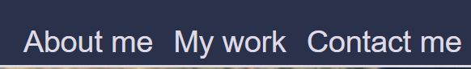
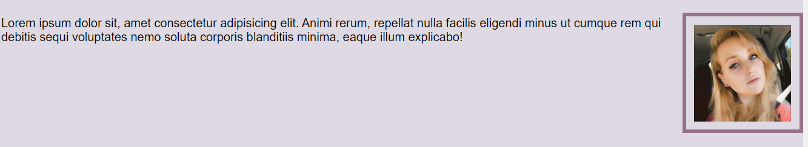
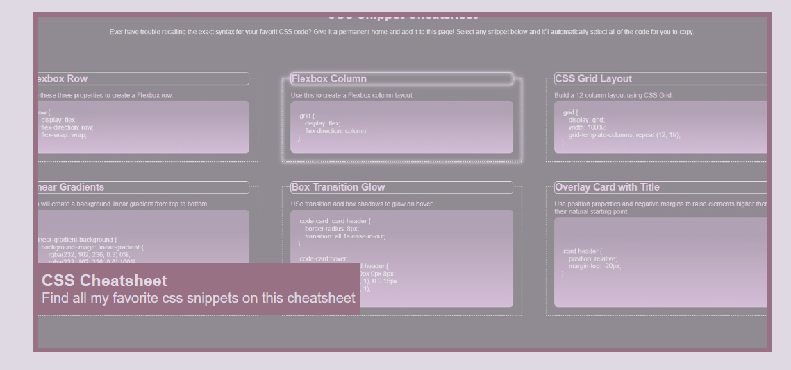
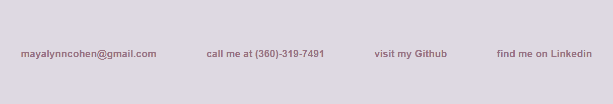

# my-portfolio

## Description

This project is meant to tell a little about myself, show off my previous work and how to contact me. It tested my html and css skills. It helped as a great excersise to train my flexbox and problem resolution skills.

## Installation

N/A.

## Usage

To visit my website go to the following URL: 
https://mayalynn96.github.io/my-portfolio/

If you hover over the nav bar section shown below they will jump up and if clicked will bring you to the correspondent section on the page.

If you hover over the about me section shown below, my profile picture will expand to the border size.

If you hover over the individual webpage previews shown below, they will zoom in and invert the opacity. If you click on it it will open the link in a new browser tab.

If you hover over the different ways to contact me as shown below, they will get bigger. If you click on the email it will open your email programm to send me an email if you have one. If you click on the phone number while on a mobile device it will give you the option to call me. if you click on the other links the URL will open in a new tab.

## Credits

N/A

## License

N/A